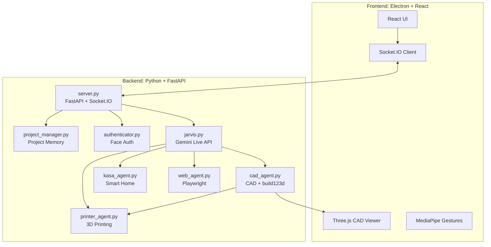

# J.A.R.V.I.S


**J.A.R.V.I.S** es un asistente de inteligencia artificial multimodal para escritorio. Integra conversacion por voz, vision por camara, gestos, generacion CAD, automatizacion web, control de dispositivos inteligentes, impresion 3D y memoria de proyectos en una aplicacion Electron con frontend React y backend Python.

> J.A.R.V.I.S = Just-in-Time Autonomous Reasoning, Vision & Integration System

---

## Caracteristicas

| Modulo | Descripcion | Tecnologia |
| --- | --- | --- |
| Voz en tiempo real | Conversacion por audio con baja latencia | Google GenAI SDK |
| CAD generativo | Generacion e iteracion de modelos 3D desde prompts | build123d, STL |
| Impresion 3D | Descubrimiento de impresoras, slicing y envio de trabajos | OrcaSlicer, Moonraker, OctoPrint |
| Vision y gestos | Interaccion con camara y seguimiento de manos | MediaPipe |
| Autenticacion facial | Bloqueo opcional mediante referencia facial local | OpenCV YuNet + SFace |
| Agente web | Navegacion automatizada en navegador | Playwright |
| Smart Home | Control de dispositivos TP-Link Kasa | python-kasa |
| Memoria de proyecto | Historial y artefactos persistentes por proyecto | JSONL y archivos locales |
| Memoria semantica (RAG) | Recuerda notas e indexa documentos (txt/md/codigo/PDF) y los recupera por significado | Gemini embeddings + vector store local (numpy) |
| Tareas | Listas de tareas con subtareas, progreso automatico y recomendacion de orden | TaskManager + JSON local, tools de voz, Socket.IO |
| Automatizaciones | Reglas evento-condicion-accion con plantillas y supervision | AutomationManager + ConditionEvaluator |
| Productividad | WhatsApp, Google Calendar y LinkedIn bajo confirmacion | OpenWA + OpenClaw (gateway) |
| Musica | Busqueda y reproduccion de musica de YouTube desde la interfaz | YouTube Data API + reproductor en el frontend |

---

## Arquitectura



---

## Requisitos

- Windows 10/11 recomendado para el estado actual del proyecto.
- Python 3.11 o superior. El entorno actual se ha validado con Python 3.13.
- Node.js 18 o superior.
- npm.
- Git.
- Camara y microfono para las funciones de voz, vision y autenticacion facial.

Conda **no es obligatorio**. Puedes usar el entorno virtual nativo de Python (`venv`) o Conda. Si no tienes Conda instalado, no hace falta instalarlo: usa la opcion A.

---

## Instalacion

Primero clona el repositorio:

```powershell
git clone https://github.com/Adriram04/jarvis.git
cd jarvis
```

### Opcion A: sin Conda, usando venv

Esta es la opcion recomendada si quieres la instalacion mas directa. No requiere instalar nada extra aparte de Python.

```powershell
python -m venv venv
.\venv\Scripts\Activate.ps1

python -m pip install --upgrade pip
pip install -r requirements.txt
playwright install chromium

npm install
```

Para volver a activar el entorno en otra terminal:

```powershell
.\venv\Scripts\Activate.ps1
```

### Opcion B: con Conda, opcional

Usa esta opcion solo si ya tienes Conda instalado o si prefieres gestionar tus entornos con Conda.

```powershell
conda create -n jarvis python=3.11 -y
conda activate jarvis

python -m pip install --upgrade pip
pip install -r requirements.txt
playwright install chromium

npm install
```

Para volver a activar el entorno Conda en otra terminal:

```powershell
conda activate jarvis
```

Ambas opciones instalan las mismas dependencias. La aplicacion funciona correctamente sin Conda usando `venv`.

---

## Variables de entorno

Crea un archivo `.env` en la raiz del proyecto:

```env
GEMINI_API_KEY=tu_api_key_aqui
# Opcional: modelo principal y alternativas para generacion CAD.
JARVIS_CAD_MODEL=gemini-2.5-flash
JARVIS_CAD_FALLBACK_MODELS=gemini-2.5-flash-lite
# Opcional: limite de ejecucion para scripts CAD generados por IA.
JARVIS_CAD_SCRIPT_TIMEOUT_SECONDS=30
# Opcional: limite de ejecucion para OrcaSlicer/PrusaSlicer.
JARVIS_SLICER_TIMEOUT_SECONDS=300

# Opcional: gateway interno para automatizacion externa.
JARVIS_OPENCLAW_ENABLED=false
JARVIS_OPENCLAW_MODE=cli
JARVIS_OPENCLAW_EXECUTABLE=openclaw
JARVIS_OPENCLAW_BASE_URL=http://localhost:18789
JARVIS_OPENCLAW_TIMEOUT_SECONDS=60
JARVIS_REQUIRE_CONFIRMATION_FOR_SEND=true
JARVIS_OPENCLAW_AUTOPILOT_ENABLED=true
```

Puedes crear una API key desde Google AI Studio:

https://aistudio.google.com/app/apikey

No subas `.env` al repositorio.

---

## Automatizacion externa

J.A.R.V.I.S puede delegar acciones externas en una capa interna de automatizacion. Jarvis sigue siendo siempre quien interpreta, redacta y responde al usuario; la capa externa solo ejecuta acciones tecnicas cuando esta configurada.

El alcance de la integracion externa se limita a tres servicios: WhatsApp, Google Calendar y LinkedIn. Correo electronico, Telegram y otros canales quedan explicitamente fuera del alcance.

Capacidades previstas:

- Mensajeria de WhatsApp: preparar, enviar y responder mensajes si el canal esta configurado.
- Calendario (Google Calendar): consultar agenda y crear, modificar o cancelar eventos con confirmacion cuando proceda.
- Redes profesionales (LinkedIn): preparar, adaptar, programar y publicar contenido con confirmacion.
- Workflows personales y reglas de respuesta automatica autorizadas.

Las acciones sensibles se guardan como pendientes y requieren confirmacion, salvo reglas automaticas limitadas que hayan sido autorizadas previamente.

---

## Ejecucion

### Modo normal

Con el entorno Python activado, ejecuta:

```powershell
npm run dev
```

Este comando arranca Vite, Electron y el backend Python automaticamente. Electron intenta usar primero `venv` local (`venv\Scripts\python.exe` en Windows). Si quieres forzar otro interprete, define `JARVIS_PYTHON` antes de arrancar:

```powershell
$env:JARVIS_PYTHON="C:\ruta\a\python.exe"
npm run dev
```

### Modo desarrollo con backend separado

Terminal 1:

```powershell
.\venv\Scripts\Activate.ps1
python backend\server.py
```

Terminal 2:

```powershell
npm run dev
```

Si estas usando Conda, sustituye la activacion de `venv` por:

```powershell
conda activate jarvis
```

---

## Configuracion

La configuracion local del backend vive en:

```text
backend/settings.json
```

Campos importantes:

| Clave | Descripcion |
| --- | --- |
| `face_auth_enabled` | Activa o desactiva la autenticacion facial. |
| `tool_permissions` | Define que herramientas requieren confirmacion manual. |
| `printers` | Lista de impresoras 3D guardadas. |
| `kasa_devices` | Lista de dispositivos Kasa conocidos. |
| `camera_flipped` | Invierte la direccion horizontal de la camara si es necesario. |

---

## Autenticacion facial

La autenticacion facial es opcional. Para usarla:

1. Captura una imagen de referencia:

   ```powershell
   python backend\capture_face.py
   ```

2. Comprueba que se ha creado:

   ```text
   backend/reference.jpg
   ```

3. Activa `face_auth_enabled` en `backend/settings.json`.

La imagen de referencia se procesa localmente y no debe subirse al repositorio. Los modelos YuNet/SFace de OpenCV se descargan automaticamente en `backend/` la primera vez que se inicializa la autenticacion.

---

## Impresion 3D

J.A.R.V.I.S puede descubrir impresoras 3D en red y enviar trabajos de impresion desde modelos STL generados.

Compatibilidad prevista:

- Moonraker/Klipper, por ejemplo Creality K1.
- OctoPrint.
- PrusaLink, de forma experimental.

Para usar esta parte, instala OrcaSlicer o PrusaSlicer y asegurate de que la impresora y el ordenador esten conectados a la misma red local.

---

## Tareas

J.A.R.V.I.S incluye un gestor de tareas tipo checklist. Una **tarea** es un proceso compuesto por varias **subtareas**; el porcentaje de progreso se calcula automaticamente segun las subtareas completadas (nunca se introduce a mano). Los datos se guardan en `backend/tasks_store.json` y cualquier cambio se propaga en tiempo real por Socket.IO (`tasks_update`), venga de la interfaz o de un comando de voz.

Desde la pestana **Tareas** del panel puedes: crear tareas, anadir subtareas (con prioridad y duracion estimada opcionales), marcar/desmarcar completadas (se muestran tachadas), ver la barra de progreso, entrar al detalle, editar nombres y eliminar tareas o subtareas.

Por voz o chat:

- "Jarvis, crea una tarea llamada Tareas para la fiesta"
- "Anade la subtarea Comprar comida a la tarea de la fiesta"
- "Marca como completada Comprar comida" / "Desmarca Comprar comida"
- "Que porcentaje llevo de la tarea de la fiesta?" -> "Llevas un 40% completado."
- "Que me recomiendas hacer primero?" -> orden sugerido por urgencia, tiempo y dependencias
- "Muestrame las pendientes de la fiesta"

La recomendacion de orden usa Gemini (`JARVIS_TASKS_MODEL`, por defecto `gemini-2.5-flash`) para razonar urgencia/tiempo/dependencias, con un *fallback* heuristico determinista (prioridad + duracion) si no hay API o se agota la cuota.

API REST:

```http
GET    /api/tasks
GET    /api/tasks/{id}
POST   /api/tasks                              {"title": "...", "description": "..."}
PUT    /api/tasks/{id}                         {"title": "...", "description": "..."}
DELETE /api/tasks/{id}
POST   /api/tasks/{id}/subtasks                {"title": "...", "priority": "high", "estimated_duration": "2h"}
PUT    /api/tasks/{id}/subtasks/{subtaskId}    {"completed": true, "title": "..."}
DELETE /api/tasks/{id}/subtasks/{subtaskId}
POST   /api/tasks/{id}/recommend
```

---

## Memoria semantica (RAG)

J.A.R.V.I.S dispone de una memoria de largo plazo basada en recuperacion semantica. El texto, las notas y los documentos que se le indican se dividen en fragmentos, se vectorizan con el modelo de embeddings de Gemini (`gemini-embedding-001`) y se guardan en un vector store local en `projects/memory_store` (matriz numpy + JSON, sin base de datos externa). En una consulta, Jarvis recupera los fragmentos mas parecidos por significado y responde sobre ellos.

Por voz o chat:

- "Jarvis, recuerda que el filamento PLA esta en el cajon de abajo" -> guarda el dato.
- "Jarvis, indexa este PDF: C:\\ruta\\apuntes.pdf" -> ingiere el documento.
- "Jarvis, que dije sobre el filamento?" -> busca y responde con lo recordado.

Tambien por API REST:

```http
POST   /api/memory/remember     {"text": "..."}
POST   /api/memory/search       {"query": "...", "k": 5}
POST   /api/memory/ingest       (multipart: file)
GET    /api/memory/stats
DELETE /api/memory
```

Formatos admitidos para ingesta: texto, markdown, codigo, json y PDF. Requiere `GEMINI_API_KEY`; si no esta configurada, la memoria se desactiva de forma transparente.

Ademas:

- **Pestana "Memoria"** en el panel: subir documentos por drag and drop, guardar notas, buscar por significado y ver/vaciar los fragmentos indexados.
- **Auto-ingesta del chat**: las conversaciones completas se guardan automaticamente en memoria (configurable con `JARVIS_MEMORY_AUTO_INGEST_CHAT` y `JARVIS_MEMORY_CHAT_MIN_CHARS`).
- **Citaciones**: al responder desde memoria, Jarvis menciona la fuente ("segun tu documento X...", "segun la nota que guardaste...").

---

## Tests

Ejecutar toda la suite configurada:

```powershell
.\venv\Scripts\python.exe -m pytest
```

Ejecutar un modulo concreto:

```powershell
.\venv\Scripts\python.exe -m pytest tests\test_cad_agent.py
.\venv\Scripts\python.exe -m pytest tests\test_web_agent.py
.\venv\Scripts\python.exe -m pytest tests\test_printer_agent.py
```

Ejecutar un test especifico:

```powershell
.\venv\Scripts\python.exe -m pytest tests\test_cad_agent.py::TestCadGeneration::test_generate_simple_cube
```

Si estas usando Conda:

```powershell
conda activate jarvis
python -m pytest
```

Estado validado recientemente:

```text
338 passed, 11 skipped
```

Los tests saltados son omisiones condicionales que requieren recursos reales no siempre disponibles en el entorno automatizado: dispositivos TP-Link Kasa configurados, inicializacion del reconocedor facial, una clave real de Gemini para embeddings o generacion CAD pesada con build123d.

---

## Estructura del proyecto

```text
jarvis/
|-- backend/
|   |-- server.py              # FastAPI + Socket.IO
|   |-- jarvis.py              # Integracion principal con Gemini Live API
|   |-- cad_agent.py           # Generacion e iteracion CAD
|   |-- printer_agent.py       # Descubrimiento, slicing e impresion 3D
|   |-- web_agent.py           # Automatizacion web con Playwright
|   |-- kasa_agent.py          # Control TP-Link Kasa
|   |-- authenticator.py       # Autenticacion facial con OpenCV YuNet + SFace
|   |-- capture_face.py        # Captura de imagen facial de referencia
|   |-- project_manager.py     # Gestion de proyectos y memoria
|   |-- memory_agent.py        # Memoria semantica (RAG): embeddings + vector store local
|   |-- task_manager.py        # Gestor de tareas/subtareas con progreso y recomendacion
|   |-- tools.py               # Definiciones de herramientas para Gemini
|   |-- settings.json          # Configuracion local
|   |-- face_detection_yunet_*.onnx    # Modelo descargado localmente
|   `-- face_recognition_sface_*.onnx # Modelo descargado localmente
|-- src/
|   |-- App.jsx
|   |-- main.jsx
|   |-- index.css
|   `-- components/
|-- electron/
|   `-- main.js
|-- tests/
|-- projects/
|-- scripts/
|-- public/
|-- requirements.txt
|-- package.json
|-- pytest.ini
`-- README.md
```

---

## Comandos utiles

```powershell
npm run dev                         # Arranca la app en modo desarrollo
npm run build                       # Genera build de frontend
.\venv\Scripts\python.exe -m pytest # Ejecuta tests con venv
python backend\server.py            # Arranca solo el backend
python backend\capture_face.py      # Captura reference.jpg
```

---

## Seguridad

- No subas `.env` al repositorio.
- No subas `backend/reference.jpg`.
- Revisa las confirmaciones antes de permitir escrituras en disco, navegacion web o impresion 3D.
- Los datos de proyectos se guardan localmente en `projects/`.

---

## Limitaciones conocidas

- La API de Gemini requiere conexion a internet.
- Algunas funciones dependen de hardware local: camara, microfono, impresora 3D o dispositivos Kasa.
- Las pruebas de Kasa se saltan si no hay dispositivos configurados.
- La impresion 3D depende de la configuracion del slicer y de la red local.

---

## Licencia

Este proyecto esta publicado bajo licencia MIT. Consulta [LICENSE](LICENSE) para mas detalles.

---

Desarrollado por Adrian Ramirez Gil.

## Modo simulación para defensa

Para enseñar J.A.R.V.I.S sin depender de hardware real, el modo simulación se activa desde Jarvis diciendo:

> "Jarvis, activa el modo simulación"

También puede activarse desde el panel visual o mediante:

```http
POST /api/simulation/activate
```

Para desactivarlo:

```http
POST /api/simulation/deactivate
```

Este modo crea dispositivos Kasa e impresoras 3D simuladas. Sirve para mostrar detección, control, estados y progreso durante la exposición aunque no haya dispositivos físicos conectados.

### Componentes simulados

- Kasa:
  - Luz escritorio demo.
  - Enchufe impresora demo.
  - Tira LED exposición.
- Impresoras:
  - Creality K1 Demo, Moonraker simulado.
  - OctoPrint Demo, OctoPrint simulado.
